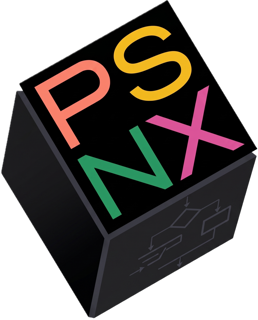

# 🚀 PsNext: PseudoCode Next

> **"Todo sistema tiende a la entropía; documentar es nuestra forma de rebeldía frente al olvido... y programar es nuestra forma de restaurar el orden."**

<p align="center">
  
</p>

[](https://opensource.org/licenses/MIT)


**PsNext** es un intérprete de pseudocódigo moderno, diseñado desde cero para la próxima generación de desarrolladores. Inspirado en el legado de PSeInt, pero reconstruido con la potencia de **.NET 10** y una estética minimalista inspirada en **NeXT**, ofrece una experiencia web fluida, visual y profundamente técnica.

---

### 🧠 Filosofía de Ingeniería
Como desarrollador con 18 años en el ecosistema Microsoft, creo que las herramientas de enseñanza deben ser tan robustas como los sistemas de producción. PsNext no es solo un juguete educativo; es un ejercicio de **alta performance**:

*   **Zero-Allocation Lexer:** Utilizo `ReadOnlySpan<char>` para minimizar las asignaciones de memoria durante la tokenización, llevando técnicas de optimización de nivel senior al mundo educativo.
*   **AST de Descenso Recursivo:** Un parser sólido que genera un árbol sintáctico ejecutable, permitiendo una visualización del estado de variables en tiempo real.
*   **Web-First & Offline:** Implementado con **Blazor WebAssembly**, funciona sin instaladores pero con la potencia de un binario nativo.

---

### ✨ ¿Por qué PsNext?
Las herramientas actuales han cumplido su ciclo. PsNext nace para llenar el vacío entre la lógica inicial y el desarrollo profesional:

*   **Editor de Clase Mundial:** Basado en el motor de **VS Code (Monaco Editor)**.
*   **Performance Senior:** Motor construido sobre **.NET 10 (LTS)**.
*   **Estética NeXT:** Un tributo a la ingeniería de Steve Jobs: funcional, oscura y elegante.

---

### 🚀 Roadmap de Evolución
*   [ ] **Fase 1:** Integración de Monaco Editor y resaltado de sintaxis.
*   [ ] **Fase 2:** Lexer y Parser base (variables, condicionales, bucles).
*   [ ] **Fase 3:** Debugger paso a paso con inspección de memoria.
*   [ ] **Fase 4:** Transpiler a código real (C#, Python, JavaScript).

---

### 🛠️ Desarrollo Local
```bash
git clone [https://github.com/ArmandIsCoding/PsNext.git](https://github.com/ArmandIsCoding/PsNext.git)
cd PsNext
dotnet watch run --project PsNext

```

---

### 📝 Bitácora del Arquitecto (Blog Insight)

Este proyecto representa mi intersección favorita: **Software e Inteligencia Artificial**. En el futuro, PsNext integrará asistencia de modelos locales (como los que exploro en **NoPilot**) para ayudar a los estudiantes a entender no solo *qué* escriben, sino *por qué* funciona. Podés seguir el progreso de esta visión en mi blog central.

🌐 **[helloworld.com.ar](https://helloworld.com.ar)**

---

### 🤝 Contribuir

Las pull requests son bienvenidas. Si sos de **Santa Fe** y querés discutir sobre gramáticas formales o arquitectura de software, el primer liso corre por mi cuenta! 🍻

---

*Hecho con ❤️ en Santa Fe, Argentina. "Stay hungry, stay foolish."*
